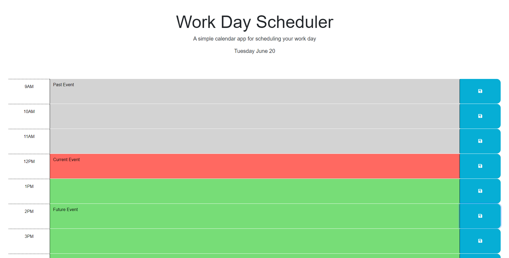

# Work Day Scheduler

## Description

This is a schedule for your typical 9-5 work day broken up in to blocks by the hour. You're able to type in to each block events for your schedule. The schedule is color coded by grey for past events, red for the current hour, and green for the future events. At the top the day of the week is displayed. When you add a new event to your schedule, it is saved in local storage and stays on the page even when refreshed.

## Skills Used

In this challenge I have saved elements in variables to use in functions that keep track of the day of the week, the hours of the day, the button for saving events, and the text input by the user. I have a function looping through the divs that act as time blocks using the parent id and subtracting by 9 to account for the index in the array in order to assign the proper class depending on the time of day. Then there is a function updating the current day at the top of the page. Lastly I have a for loop adding an event listener to each save button in order to save the text in local storage and populate what you've saved in each time block on the page.

## Installation

Install locally with:
```
git clone https://github.com/larsly/Work-Day-Scheduler
```


## Usage

To view the live website go to [https://larsly.github.io/Work-Day-Scheduler/](https://larsly.github.io/Work-Day-Scheduler/)




## Credits

N/A

## License

